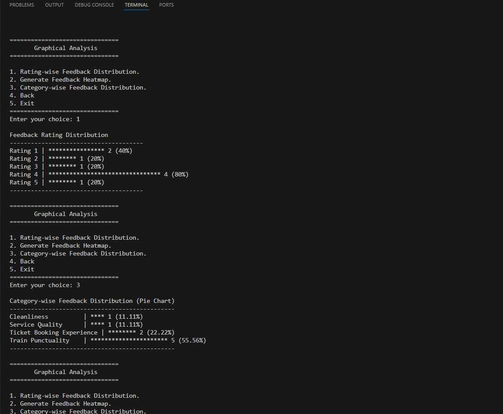
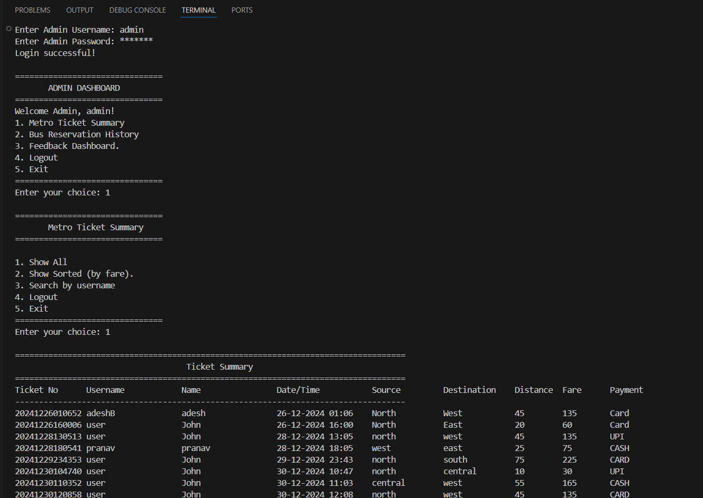
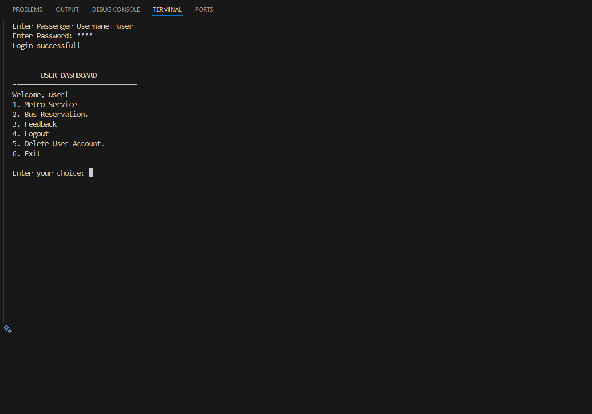
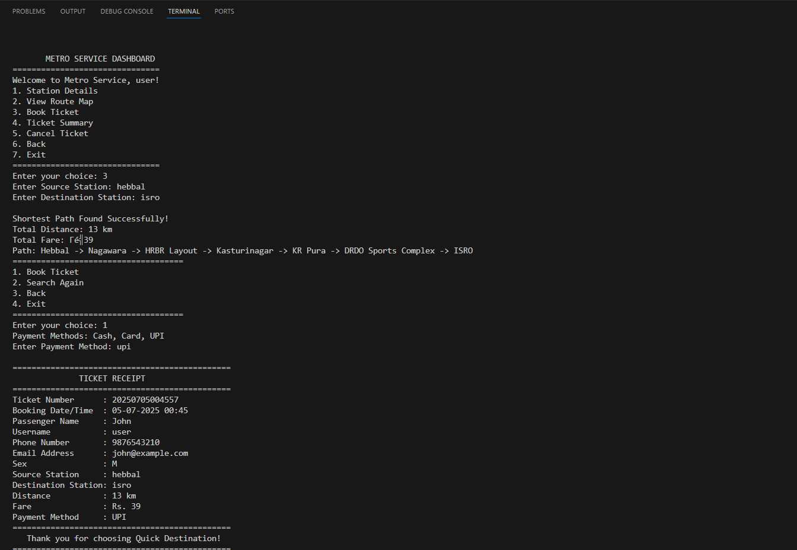

# 🚀 Quick Destination


**Quick Destination** is a console-based C++ project that simulates a metro and bus booking system. Users can book metro tickets based on shortest path routes, manage bus reservations, give feedback, and more. Admins can view ticket summaries, manage users, and access booking history.

---

## 🎯 Features

- 👤 User Sign Up & Login  
- 🧾 Metro Ticket Booking using Dijkstra’s Algorithm  
- 🚌 Bus Reservation History  
- ❌ Ticket Cancellation  
- 🗣️ Feedback Submission  
- 🔐 Admin Dashboard and Password Reset  
- 💾 Data stored in `.txt` files (CSV-style)

---

## 🛠️ Technologies Used

- C++ (Standard Template Library)
- File I/O Handling
- Graph Algorithms (Dijkstra’s)
- String Matching (KMP, Rabin-Karp)

---

## 📁 Project Folder Structure

```
QuickDestination/
├── data/                # Text-based database
│   ├── admins.txt
│   ├── users.txt
│   ├── tickets.txt
│   ├── stations.txt
│   ├── matrix.txt
│   ├── booking_history.txt
│   └── feedback.txt
├── src/                 # Source code
│   └── main.cpp
├── screenshots/         # Screenshots for documentation
│   ├── feedback_graph.png
│   ├── admin_dashboard.png
│   ├── user_dashboard.png
│   └── metro_booking.png
├── README.md            # You're reading this!
├── LICENSE              # Open-source license
└── .gitignore           # Ignore compiled files
```

---

## 🏁 Getting Started

Follow these steps to set up and run the project.

### 🔹 1. Clone this repository

```bash
git clone https://github.com/<your-username>/QuickDestination.git
```
> Replace `<your-username>` with your GitHub username.

---

### 🔹 2. Navigate into the project folder

```bash
cd QuickDestination
```

---

### 🔹 3. Compile the code

```bash
cd src
g++ -o QuickDestination main.cpp
```

✅ On Windows:
```bash
g++ main.cpp -o QuickDestination.exe
```

---

### 🔹 4. Run the application

On Linux/macOS:
```bash
./QuickDestination
```

On Windows:
```bash
QuickDestination.exe
```

---

### 🔹 5. Ensure Data Files Exist

Make sure the `data/` folder contains:

- `admins.txt`
- `users.txt`
- `tickets.txt`
- `stations.txt`
- `matrix.txt`
- `booking_history.txt`
- `feedback.txt`

✅ The app creates these files automatically if they don’t exist.

---

## 📊 Algorithms Used

- **Dijkstra’s Algorithm** – Find the shortest path between metro stations.
- **KMP & Rabin-Karp** – Fast string matching for station searches.

---

## 📸 Screenshots

### 🔹 Feedback Graphical Analysis


---

### 🔹 Admin Dashboard


---

### 🔹 User Dashboard


---

### 🔹 Metro Booking Example


---

## 🔮 Future Improvements

- Replace text files with a real database (e.g., SQLite)
- Encrypt passwords for better security
- Modularize into multiple source/header files
- Add automated unit testing
- Build a graphical or web-based interface

---

## 📄 License

This project is licensed under the MIT License.  
See the [LICENSE](LICENSE) file for details.

---

## 🙌 Author

Made with ❤️ by **Abhishek Sutar**  
For academic and learning purposes.
